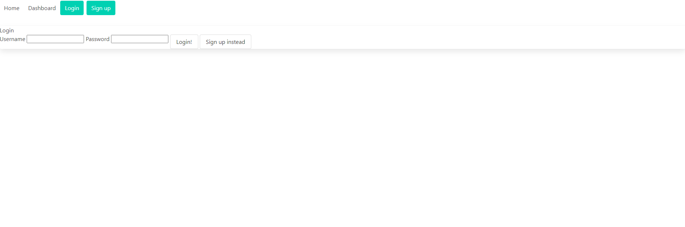

# Kristers Employee Tracker
      

  
  ## Description
The Tech Blog shows some of my newly learned skills working with API routes, formhandlers, models and handlebars. I have learned an introduction in how you can build a full stack app. I spent a long time working on this app and I ended up not getting as far as i hoped. The delete and update function is currently not functioning. 
  
  ## Table of Contents
  * [Installation](#installation)
  * [Usage](#usage)
  * [Credits](#credits)
  * [License](#license)
  * [Contributing](#contributing)
  * [Questions](#questions)

  ## Installation
  Download and install folder, install node and run npm i, then node server.js in the integrated terminal. The application does not have seeds, but you can create a user and create content to use it. To comment on a post go to the home page and click on the tilte of a post and you will be directed to the comment page. 

  Github Repository: https://github.com/kristermyr/technology-blog
  Heroku: https://kristerstechblog.herokuapp.com/

  ## Usage
  
  

  ## Dependencies
  Inquirer, Sequilize 

  ## Credits
    Class activities
    
  ## Github
  * https://github.com/LunaRossie/MVC_Tech_Blog---
  * https://github.com/mjgiannelli/tech-blog
  * https://github.com/sylviaprabudy/tech-blog
  * https://github.com/nicolewallace09/the-tech-blog
  * https://github.com/dylanquaale/tech-blog

  ## Youtube
  * https://www.youtube.com/watch?v=FijGmbJzPSM&ab_channel=TheNetNinja
  * https://www.youtube.com/watch?v=HmfQq0suMSA&t=314s&ab_channel=TheNetNinja

  ## Collaborators
  * Dylan Quaale - https://github.com/dylanquaale/tech-blog

  ## License
  MIT

  ## Contributing
  Create a new branch and submit a pull request

  ## Questions
  Github Username: kristermyr
  Please send me an E-mail if you have any questions [here](mailto:krister90@gmail.com) or visit https://github.com/kristermyr

